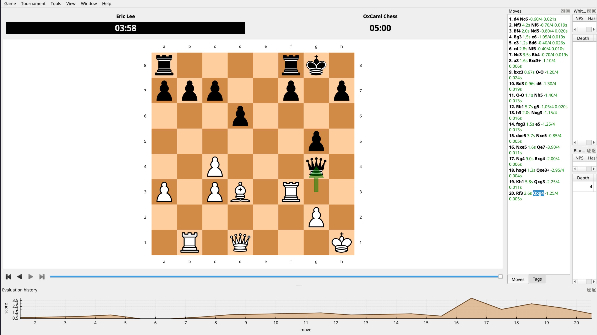

# OxCaml Chess



This repository contains a simple zero heap allocation chess engine leveraging [OxCaml](https://oxcaml.org/)'s unboxed types, modes, and uniqueness. The intent was to experiment with OxCaml's abilities to write low level and expressive programs, avoiding heap allocations at all costs.

Bitboards, attack generation, and pseudolegal move generation for every move type
are complete, and we compare against known perft values. The engine understands [UCI](https://en.wikipedia.org/wiki/Universal_Chess_Interface), so it plays in any GUI (including [Lichess](https://lichess.org/))!. A minimal search function with alpha-beta pruning and MVV-LVA move ordering is implemented as a proof of concept.

*Note: This project primarily was to explore OxCaml, not chess programming. The framework for the engine is stable, but the actual evaluation and search functionality only does the bare minimum.*

## Quickstart

```bash
# Setting up opam switch
opam repository add ox git+https://github.com/oxcaml/opam-repository.git --dont-select
opam switch create oxcaml-chess --repos ox,default ocaml-variants.5.2.0+ox
opam install . --deps-only
opam env --switch=oxcaml-chess

dune build --profile release                # Binary built in ./_build/default/bin/main.exe
dune runtest                                # Runs expect tests in `lib` and general tests in `test`
dune build --profile dump --cache=disabled  # Dump asm/cmm into _build/default/lib/<lib>/.<lib>.objs/native/
```

## Playing

`bin/main.exe` speaks UCI on stdin, with the addition of `disp` to print the board. You could play entirely using this interface:

```console
>>> printf 'uci\nposition startpos moves e2e4 e7e5\ndisp\ngo\nquit\n' | ./_build/default/bin/main.exe
id name OxCaml Chess
id author Eric Lee
uciok
8 r n b q k b n r   White to move
7 p p p p . p p p   castling KQkq
6 . . . . . . . .   en passant e6
5 . . . . p . . .   halfmove 0
4 . . . . P . . .   fullmove 2
3 . . . . . . . .
2 P P P P . P P P
1 R N B Q K B N R
  a b c d e f g h
info depth 4 score cp -65 nodes 48828
bestmove d1h5
```

To play in a GUI, [cutechess](https://cutechess.com/) works well. [Fastchess](https://github.com/Disservin/fastchess) may work better for tournaments or a pure CLI interface.

## OxCaml in practice

We assume familiarity with OCaml, but not necessarily chess programming or OxCaml, and go through some examples on how we achieved a more efficient chess engine that could have been implemented (easily without FFI) in OCaml.

### Bitboards

A chess board has 64 squares, so a *set* of squares fits exactly in a 64-bit integer, called a [bitboard](https://www.chessprogramming.org/Bitboards). The problem is that OCaml has [63 bit integers](https://blog.janestreet.com/what-is-gained-and-lost-with-63-bit-integers/) as one bit is reserved for the garbage collector, meaning `Int64.t` is boxed and allocated on the heap. OxCaml provides an [unboxed](https://oxcaml.org/documentation/unboxed-types/intro/) version `int64#`. It has [kind](https://oxcaml.org/documentation/kinds/intro/) `bits64` rather than `value`, which is the type system's way validating that this is not a pointer, so it can live in a register as expected. Therefore, none of these operations allocate on the heap:

```ocaml
type t = int64#

let count t = I.to_int (U.count_set_bits t)
let lowest_square t = Square.unsafe_of_int (I.to_int (U.count_trailing_zeros t))
let remove_lowest t = I.logand t (I.sub t #1L)
```

This means chess rules turn into set arithmetic, and we can use logical operations cleanly without worrying about heap allocations.

```ocaml
let pushed = B.(advanced land vacant)
let pushed_twice = B.(shift (pushed land rank_mask staging) forward land vacant)
```

### Unboxed records

A `Board.t` contains nine bitboards, one per piece kind, one per color, and one extra to mark every occupied square. In ordinary OCaml, a record of nine `Int64.t` is *ten* heap blocks, but an [unboxed record](https://oxcaml.org/documentation/unboxed-types/intro/) in OxCaml (written `#{ ... }`) has no block at all. It is passed as nine words as expected:

```ocaml
type t = private
  #{ pawns : Bitboard.t ; knights : Bitboard.t ; (* ... *) occupancy : Bitboard.t }
```

We use `private` because making it abstract would force me to [write out the kind by hand](https://oxcaml.org/documentation/kinds/syntax/) (`type t : bits64 & bits64 & ...`, once per field). The same idea shows up in other places, such as returning multiple values cleanly in `search`:

```ocaml
type node = #{ depth : int ; ply : int ; alpha : int ; beta : int }
type result = #{ score : int ; move : Move.t or_null ; nodes : int }
```

### `local` and `unique`

Move generation fills a scratch buffer of up to 255 moves, which the search sorts in place so the best captures are tried first. Sorting in place is fast, and also a really easy way to corrupt a buffer something else is still reading. `Movelist` uses [`local`](https://oxcaml.org/documentation/stack-allocation/intro/) (value never escapes the region it was made in, so the buffer lives on the stack), and [`unique`](https://oxcaml.org/documentation/uniqueness/intro/) (no other reference to it exists) to ensure statically that this could never happen, and no heap allocations are made as the buffer can be reused.

```ocaml
val build  : (builder @ local -> unit) @ local -> t @ local unique
val push   : builder @ local -> Move.t -> unit
val sorted : t @ local unique -> score:(Move.t -> int) -> t @ local
```

Reading and writing are different types, although they are the same types under the hood. `build` hands a `builder` to a callback and seals the result into a readable `t`, which is the only way to obtain one, so nothing can write to a list being read. `sorted` then consumes the list uniquely, which is what makes the in-place sort safe by construction.

```ocaml
let build f : t @ local unique = exclave_
  let builder = { moves = Array.create_local ~len:capacity dummy_move; length = 0 } in
  f (borrow_ builder);
  builder
;;
```

A major payoff is `sorted`, which reorders the buffer in place precisely because `unique` proved nobody else is holding it. We also can leverage locally mutable variables as well, which live on the stack (unlike `ref`):

```ocaml
let sorted (t : t @ local unique) ~score : t @ local =
  let arr = t.moves in
  for i = 1 to t.length - 1 do
    let move = arr.(i) in
    let move_score = score move in
    let mutable j = i in
    while j > 0 && score arr.(j - 1) < move_score do
      arr.(j) <- arr.(j - 1);
      j <- j - 1
    done;
    arr.(j) <- move
  done;
  t
;;
```

This was probably one of the more insightful parts for me. It was also one of the more frustrating parts, fighting with closures enclosing local functions and values.

### `or_null`

In OCaml, `Some x` is a heap allocation. [`or_null`](https://oxcaml.org/documentation/unboxed-types/or-null/) represents the empty case as a real null pointer instead, avoiding yet more heap allocations:

```ocaml
let move =
  match Board.kind_at board to_ with
  | Null -> Move.quiet ~moved ~from ~to_
  | This captured -> Move.capture ~moved ~captured ~from ~to_
in
```

Null must be distinguishable from the value, so `or_null` demands a kind of `value mod non_null`, which was sometimes frustrating to deal with. `ppx_template` is provided to use higher ordered functions with various layouts, but `or_null` typically does not work well, and I ended up rewriting many basic functions myself.

## Testing

Everything is an expect test, and almost all of them sit at the bottom of the module they cover (`lib`). The `test` exists for tests that test `perft` and GC allocations. We have pretty visual outputs. For example, we have an example move generation test:

```ocaml
let%expect_test "ray stopped by capture or own piece" =
  show "4k3/8/8/3r4/8/3Q4/3P4/K7 w - - 0 1";
  [%expect
    {|
      8 . . . . k . . .   8 . . . . . . . .
      7 . . . . . . . .   7 . . . . . . . *
      6 . . . . . . . .   6 * . . . . . * .
      5 . . . r . . . .   5 . * . * . * . .
      4 . . . . . . . .   4 . . * * * . . .
      3 . . . Q . . . .   3 * * * Q * * * *
      2 . . . P . . . .   2 * * * . * . . .
      1 K . . . . . . .   1 K * . . . * . .
        a b c d e f g h     a b c d e f g h
    23 moves: Ka2 Kb1 Kb2 Qa3 Qa6 Qb1 Qb3 Qb5 Qc2 Qc3 Qc4 Qd4 Qe2 Qe3 Qe4 Qf1 Qf3 Qf5 Qg3 Qg6 Qh3 Qh7 Qxd5
    |}]
;;
```

We use the following function in `test/test_bench` to check for heap allocations:

```ocaml
let apply before move = exclave_
  Expect_test_helpers_core.require_no_allocation_local (fun () -> exclave_
    Position.make_move before move)
;;
```

Checking the output, we can see in the `words` column that there are no heap allocations:

```
┌──────────┬───────┬───────┬───────┬───────┬──────┐
│ position │ depth │ nodes │ words │ score │ move │
├──────────┼───────┼───────┼───────┼───────┼──────┤
│ startpos │ 4     │ 25332 │ 0     │   0   │ Nc3  │
│ kiwipete │ 4     │  6191 │ 0     │  70   │ Bxa6 │
│ midgame  │ 4     │ 15997 │ 0     │ -90   │ Nd5  │
│ endgame  │ 5     │  7760 │ 0     │ 110   │ Rxf4 │
└──────────┴───────┴───────┴───────┴───────┴──────┘
```

Horray!
